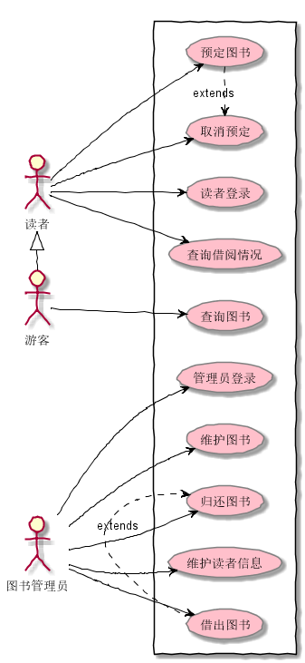
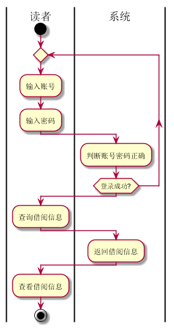
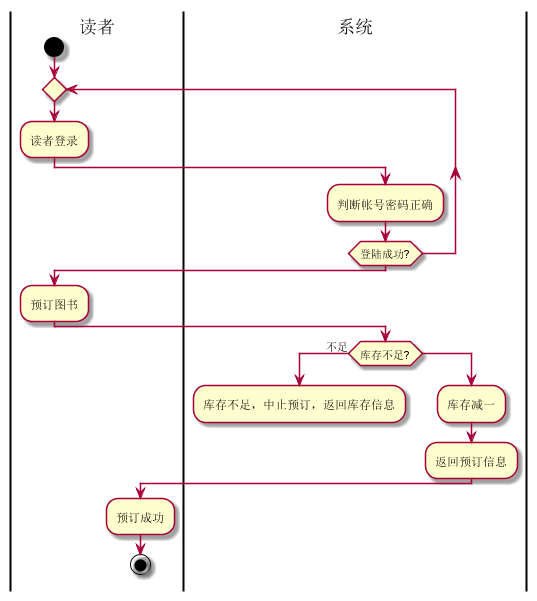
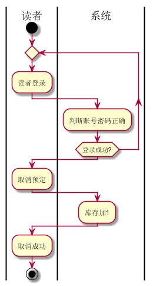
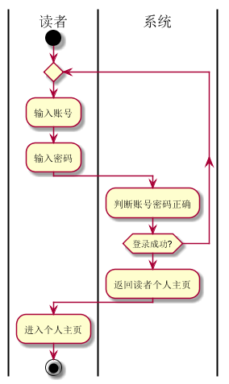
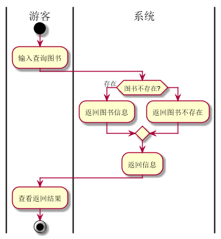
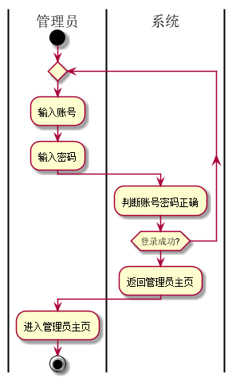
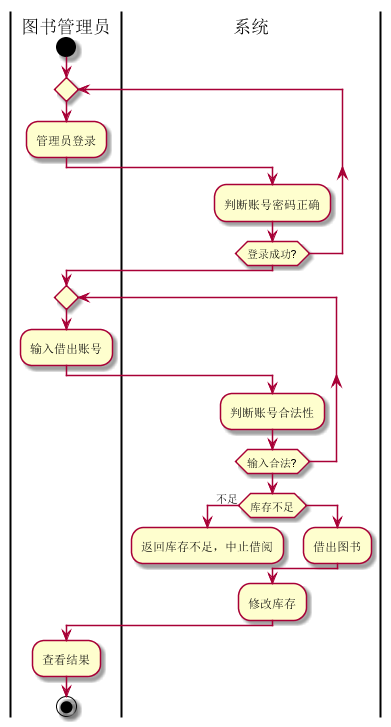
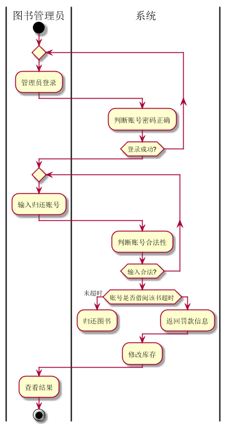
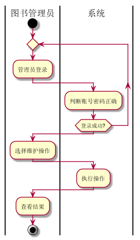

何佳倩的实验报告
============
## 实验二（test2）：图书管理系统用例建模

|学号|班级|姓名|
|:---------------:|:------------:|:------------:|
|201510414110|软工15-1|何佳倩|

### 1.图书管理系统整体的用例关系图

**1.1用例PlantUML源码如下：**
~~~
@startuml

skinparam packageStyle rectangle

:图书管理员: as manage
:游客: as visitor
:读者: as reader

reader <|- visitor
rectangle  {
	left to right direction
	manage -> (管理员登录)
	manage -> (维护图书)
	manage --> (借出图书)
	manage -> (归还图书)
	manage -> (维护读者信息)

	visitor --> (查询图书)

	reader -> (读者登录)
	reader -> (查询借阅情况)
	reader -> (预定图书)
	reader -> (取消预定)

	(借出图书) .> (归还图书) : extends
	(预定图书) .> (取消预定) : extends

}

skinparam handwritten true
skinparam usecase {
	BackgroundColor pink
	BorderColor Gray
	ArrowColor black
	ActorBorderColor black
	ActorFontName Courier

}
@enduml
~~~

**1.2用例关系图如下：**

### 2.参与者说明

**2.1图书管理员：**

主要功能是：管理员登录，维护图书、读者信息，负责图书的借还。

**2.2读者**

主要功能是：读者登录，查询图书，借阅信息，具有预订和取消预订图书功能。

**2.3游客**

主要功能是：只具有查询图书的功能。

### 3.用例的规约表

**3.1“查询借阅信息”用例**

**3.1.1“查询借阅信息”用例规约**

|用例名称|查询借阅信息|
|:-----------:|:-----------------------:|
|参与者|读者|
|前置条件|读者登录成功|
|后置条件|查询到读者借阅情况|
|主事件流|
|参与者动作|系统行为|
|1.读者登录系统| 2.系统确认帐号密码正确|
|3.读者查询借阅信息| 4.系统返回借阅信息|
|备选事件流|
|1a.账号错误 1.系统提示账号错误，重新输入|
|业务规则|
|1.系统允许多个读者同时查询借阅信息，并对应返回 2.读者只能查询自己的借阅信息|

**3.1.2“查询借阅信息”用例流程图源码如下**
~~~
@startuml
|读者|
start
repeat
:输入账号;
:输入密码;
	|系统|
	:判断账号密码正确;
repeat while (登录成功?)

|读者|
:查询借阅信息;
|系统|
:返回借阅信息;
|读者|
:查看借阅信息;
stop
@enduml
~~~

**3.1.3“查询借阅信息”用例流程图如下**

**3.2“预订图书”用例**

**3.2.1“预定图书”用例规约**

|用例名称|预定图书|
|:-----------:|:-----------------------:|
|参与者|读者|
|前置条件|读者登录成功|
|后置条件|预定图书成功|
|主事件流|
|参与者动作|系统行为|
|1.读者登录  3.读者预定    6.预订成功| 2.系统确认登录成功 4.系统确认库存是否充足 5.系统修改图书库存|
|备选事件流|
|1a.账号错误 1.系统提示账号错误，重新输入2a.库存不足 2.系统提示库存不足，中止预订|
|业务规则|
|1.系统允许多个读者同时预订图书，并根据库存对应返回是否成功 2.读者只能预订有库存的图书|

**3.2.2“预定图书”用例流程图源码如下：**
~~~
@startuml
|读者|
start
repeat
	:读者登录;
	|系统|
	:判断帐号密码正确;
repeat while (登陆成功?)
|读者|
:预订图书;
|系统|
if(库存不足?) then (不足)
	:库存不足，中止预订，返回库存信息;
	detach
else
	:库存减一;
:返回预订信息;
|读者|
:预订成功;
stop
@enduml
~~~

**3.2.3“预订图书”用例流程图如下**

**3.3“取消预定”用例**

**3.3.1“取消预定”用例规约**

|用例名称|取消预定|
|:-----------:|:-----------------------:|
|参与者|读者|
|前置条件|读者登录到系统|
|后置条件|取消预定图书成功|
|主事件流|
|参与者动作|系统行为|
|1.读者登录  3.读者取消预定     6.取消预定成功| 2.系统确认登录成功 4.系统确认库存是否充足 5.系统修改图书库存|
|备选事件流|
|1a.账号错误 1.系统提示账号错误，重新输入|
|业务规则|
|1.系统允许多个读者同时取消预订图书，并根据库存对应返回是否成功 2.读者只能取消预订已预订的图书|

**3.3.2“取消预定”用例流程图源码如下：**
~~~
@startuml
|读者|
start
repeat
	:读者登录;
	|系统|
	:判断账号密码正确;
repeat while (登录成功?)
|读者|
:取消预定;
|系统|
:库存加1;
|读者|
:取消成功;
stop
@enduml
~~~

**3.3.3“取消预订”用例流程图如下**

*3.4“读者登录”用例**

**3.4.1“读者登录”用例规约**

|用例名称|读者登录|
|:-----------:|:-----------------------:|
|参与者|读者|
|前置条件|打开系统|
|后置条件|登录成功进入个人主页|
|主事件流|
|参与者动作|系统行为|
|1.读者输入账号密码| 2.系统确认帐号密码正确，返回信息|
|备选事件流|
|1a.账号错误 1.系统提示账号错误，重新输入 2.系统提示密码错误，重新输入|
|业务规则|
|1.系统允许多个读者同时登录系统，并对应返回 2.一个网页只能登录一个读者|

**3.4.2“读者登录”用例流程图源码如下**
~~~
@startuml
|读者|
start
repeat
:输入账号;
:输入密码;
	|系统|
	:判断账号密码正确;
repeat while (登录成功?)

:返回读者个人主页;
|读者|
:进入个人主页;

stop
@enduml
~~~

**3.6.3“读者登录”用例流程图如下**

**3.5“查询图书信息”用例**

**3.5.1“查询图书信息”用例规约**

|用例名称|查询图书|
|:-----------:|:-----------------------:|
|参与者|游客|
|前置条件|打开系统|
|后置条件|查询图书信息成功|
|主事件流|
|参与者动作|系统行为|
|1.输入查询条件   3.查询图书结果| 2.系统查询图书信息 |
|备选事件流|
|1a.图书信息不存在 1.系统提示无图书|
|业务规则|
|1.系统允许多个游客同时查询图书，并根据信息对应返回 2.游客只能查询图书|

**3.5.2“查询图书信息”用例流程图源码如下：**
~~~
@startuml
|游客|
start
	:输入查询图书;
	|系统|
if(图书不存在?) then (存在)
	:返回图书信息;
else
	:返回图书不存在;
endif
:返回信息;
|游客|
:查看返回结果;
stop
@enduml
~~~

**3.5.3“查询图书信息”用例流程图如下**

*3.6“管理员登录”用例**

**3.6.1“管理员登录”用例规约**

|用例名称|管理员登录|
|:-----------:|:-----------------------:|
|参与者|图书管理员|
|前置条件|打开系统|
|后置条件|登录成功进入管理员页面|
|主事件流|
|参与者动作|系统行为|
|1.管理员输入账号密码| 2.系统确认帐号密码正确，返回信息|
|备选事件流|
|1a.账号错误 1.系统提示账号错误，重新输入 2.系统提示密码错误，重新输入|
|业务规则|
|1.系统允许多个管理员同时登录系统，并对应返回 2.一个网页只能登录一个管理员|

**3.6.2“管理员登录”用例流程图源码如下**
~~~
@startuml
|管理员|
start
repeat
:输入账号;
:输入密码;
	|系统|
	:判断账号密码正确;
repeat while (登录成功?)

:返回管理员主页;
|管理员|
:进入管理员主页;

stop
@enduml
~~~

**3.6.3“管理员登录”用例流程图如下**

**3.7“借出图书”用例**

**3.7.1“借出图书”用例规约**

|用例名称|借出图书|
|:-----------:|:-----------------------:|
|参与者|图书管理员|
|前置条件|登录图书管理员账号|
|后置条件|借出图书成功|
|主事件流|
|参与者动作|系统行为|
|1.管理员登录   3.输入借出账号   7.查看结果| 2.判断账号合法性 4.判断账号是否合法 5.判断图书库存 6.借出图书 7.修改库存|
|备选事件流|
|1a.登录失败 1.系统提示账号密码错误 2a.库存不足 1.系统提示库存不足|
|业务规则|
|1.系统允许图书管理员执行借出图书操作|

**3.7.2“借出图书”用例流程图源码如下：**
~~~
@startuml
|图书管理员|
start
repeat
	:管理员登录;
	|系统|
	:判断账号密码正确;
repeat while (登录成功?)
|图书管理员|
repeat
	:输入借出账号;
	|系统|
	:判断账号合法性;
repeat while (输入合法?)
|系统|
if (库存不足) then (不足)
	:返回库存不足，中止借阅;
	detach
else
	:借出图书;
endif
:修改库存;

|图书管理员|
:查看结果;

stop
@enduml
~~~

**3.7.3“借出图书”用例流程图如下**

       

**3.8“归还图书”用例**

**3.8.1“归还图书”用例规约**

|用例名称|归还图书|
|:-----------:|:-----------------------:|
|参与者|图书管理员|
|前置条件|图书管理员登录|
|后置条件|归还图书成功|
|主事件流|
|参与者动作|系统行为|
|1.图书管理员登录   3.输入归还账号   7.查看结果| 2.判断账号合法性 4.判断账号是否合法 5.判断用户是否借入图书 6.归还图书 7.修改库存|
|备选事件流|
|1a.登录失败 1.系统提示账号密码错误 2a.用户借书超时 系统提示用户借书超时|
|业务规则|
|1.系统允许图书管理员执行归还图书操作|

**3.8.2“归还图书”用例流程图源码如下：**
~~~
@startuml
|图书管理员|
start
repeat
	:管理员登录;
	|系统|
	:判断账号密码正确;
repeat while (登录成功?)
|图书管理员|
repeat
	:输入归还账号;
	|系统|
	:判断账号合法性;
repeat while (输入合法?)
|系统|
if (账号是否借阅该书超时) then (未超时)
	:归还图书;
	detach
else
	:返回罚款信息;
endif
:修改库存;

|图书管理员|
:查看结果;

stop
@enduml
~~~

**3.8.3“归还图书”用例流程图如下**

    

 **3.9“维护图书”用例**

**3.9.1“维护图书”用例规约**

|用例名称|维护图书|
|:-----------:|:-----------------------:|
|参与者|图书管理员|
|前置条件|图书管理员登录|
|后置条件|维护图书成功|
|主事件流|
|参与者动作|系统行为|
|1.图书管理员登录   3.选择维护操作  5.查看结果| 2.判断账号密码正确 4.执行操作 |
|备选事件流|
|1a.登录失败 1.系统提示账号密码错误，重新输入 |
|业务规则|
|1.系统允许图书管理员执行维护图书操作|

**3.9.2“维护图书”用例流程图源码如下：**
~~~
@startuml
|图书管理员|
start
repeat
	:管理员登录;
	|系统|
	:判断账号密码正确;
repeat while (登录成功?)
|图书管理员|
:选择维护操作;
|系统|
:执行操作;

|图书管理员|
:查看结果;

stop
@enduml

~~~

**3.9.3“维护图书”用例流程图如下**

    

 **3.10“维护读者信息”用例**

**3.10.1“维护读者信息”用例规约**

|用例名称|维护读者信息|
|:-----------:|:-----------------------:|
|参与者|图书管理员|
|前置条件|图书管理员登录|
|后置条件|维护读者信息成功|
|主事件流|
|参与者动作|系统行为|
|1.图书管理员登录   3.选择维护操作  5.查看结果| 2.判断账号密码正确 4.执行操作 |
|备选事件流|
|1a.登录失败 1.系统提示账号密码错误 |
|业务规则|
|1.系统允许图书管理员执行维护读者信息操作|

**3.10.2“维护读者信息”用例流程图源码如下：**
~~~
@startuml
|图书管理员|
start
repeat
	:管理员登录;
	|系统|
	:判断账号密码正确;
repeat while (登录成功?)
|图书管理员|
:选择维护操作;
|系统|
:执行操作;

|图书管理员|
:查看结果;

stop
@enduml

~~~

**3.10.3“维护读者信息”用例流程图如下**

    