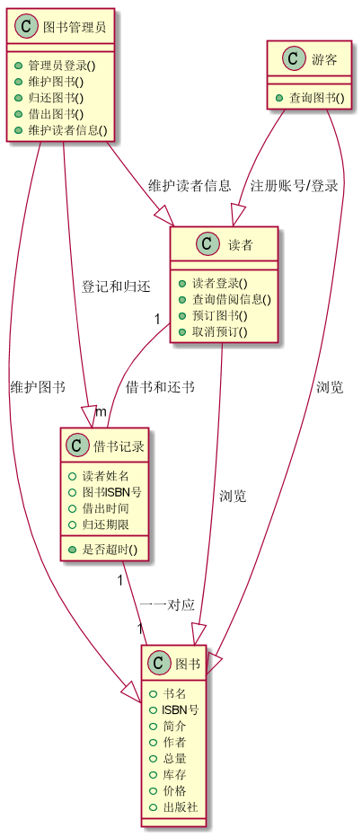
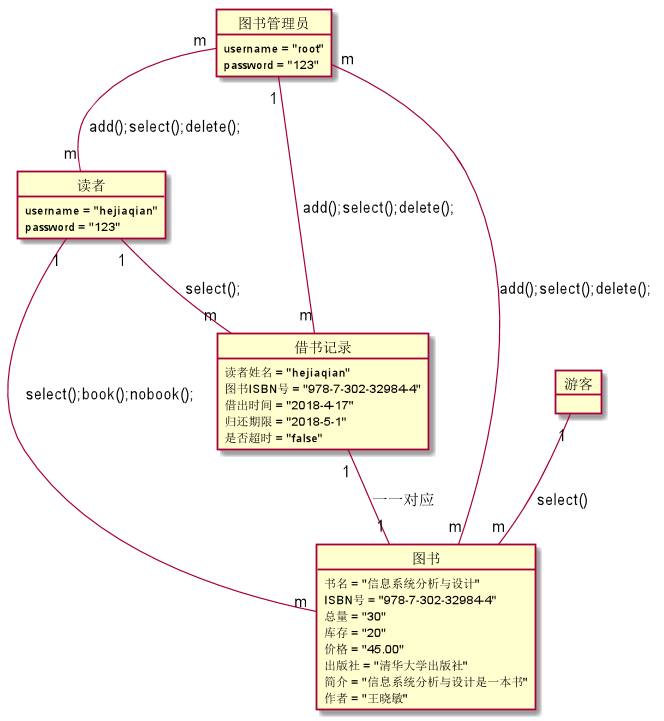

何佳倩的实验报告
============
## 实验三（test3）：图书管理系统对象建模

|学号|班级|姓名|
|:---------------:|:------------:|:------------:|
|201510414110|软工15-1|何佳倩|

### 1.图书管理系统整体的类图

**1.1图书馆管理系统用例PlantUML源码如下：**
~~~
@startuml

	class 图书管理员 {
	    +管理员登录()
		+维护图书()
		+归还图书()
		+借出图书()
		+维护读者信息()
	}

	class 读者 {
	    +读者登录()
		+查询借阅信息()
		+预订图书()
		+取消预订()
	}
	class 游客 {
		+查询图书()
	}

	class 图书 {
	 	+书名
	 	+ISBN号
	 	+简介
        +作者
	 	+总量
	 	+库存
	 	+价格
	 	+出版社
	}

	class 借书记录 {
	 	+读者姓名
	 	+图书ISBN号
	 	+借出时间
	 	+归还期限
	 	+是否超时()
	}

	图书管理员 --|> 读者 : 维护读者信息
	图书管理员 --|> 借书记录 : 登记和归还
	图书管理员 --|> 图书 : 维护图书
	读者 "1"--"m" 借书记录 : 借书和还书
    读者 --|> 图书 : 浏览
	借书记录 "1"--"1" 图书 : 一一对应
	游客 --|> 图书 : 浏览

@enduml
~~~

**1.2类图如下：**

**1.3类图说明：**
 ~~~
    管理员进行图书信息的增删改查以及读者信息的增删改查，也就是维护图书信息和读者信息，
，管理员进行借书还书操作；读者只能浏览图书信息，进行预订；游客只能浏览图书信息。
 ~~~

### 2.图书管理系统对象图

**2.1.PlantUML源码如下：**
~~~
@startuml

	object 图书管理员 {
		 username = "root"
		 password = "123"
	}

	object 读者 {
	 	username = "hejiaqian"
		password = "123"
	}
	object 游客 {

	}

	object 图书 {
	 	书名 = "信息系统分析与设计"
	 	ISBN号 = "978-7-302-32984-4"
	 	总量 = "30"
	 	库存 = "20"
	 	价格 = "45.00"
	 	出版社 = "清华大学出版社"
	 	简介 = "信息系统分析与设计是一本书"
	 	作者 = "王晓敏"
	}

	object 借书记录 {
	 	读者姓名 = "hejiaqian"
	 	图书ISBN号 = "978-7-302-32984-4"
	 	借出时间 = "2018-4-17"
	 	归还期限 = "2018-5-1"
	 	是否超时 = "false"
	}

	游客 "1"--"m" 图书 : select()
	游客 "1"--"m" 图书 : select();book();nobook();
	读者 "1" -- "m" 借书记录 : select();
	借书记录 "1" -- "1" 图书 : 一一对应
	借书记录 "m" -- "1" 图书管理员 : add();select();delete();
	图书管理员 "m" -- "m" 图书 : add();select();delete();
	图书管理员 "m" -- "m" 读者 : add();select();delete();

 @enduml

~~~

**2.2对象图如下：**

**2.3对象图说明如下：**
~~~
      游客通过使用查询方法查询到图书信息；
      管理员通过对图书信息，借书记录和读者进行add();select();
      delete();方法实现维护读者信息和图书信息，实现借书还书等功能，
      一本图书对应一条借书记录;
      读者通过select()查询借书记录，book();nobook();预定和取消预定图书
~~~

