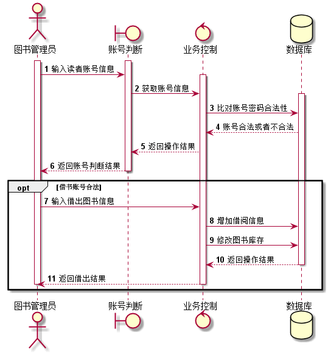
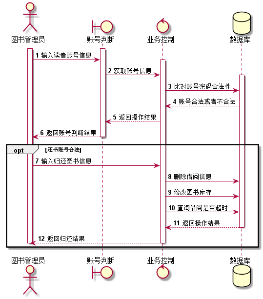
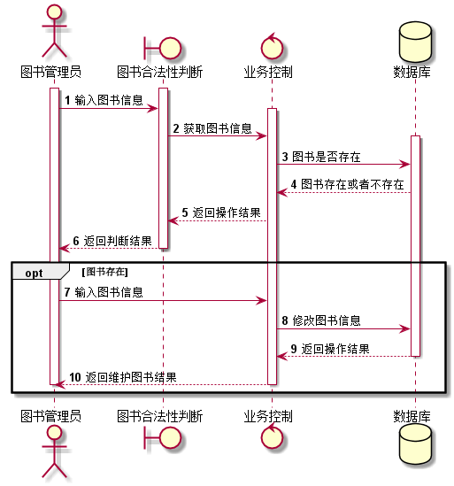
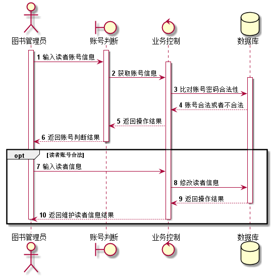
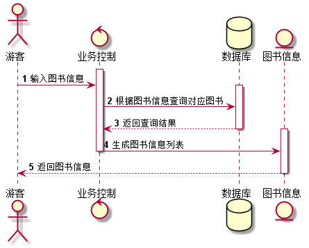
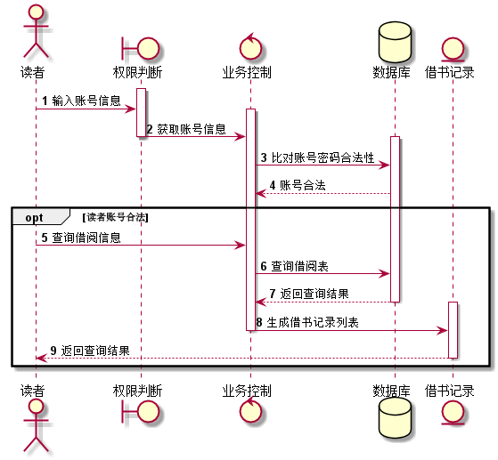
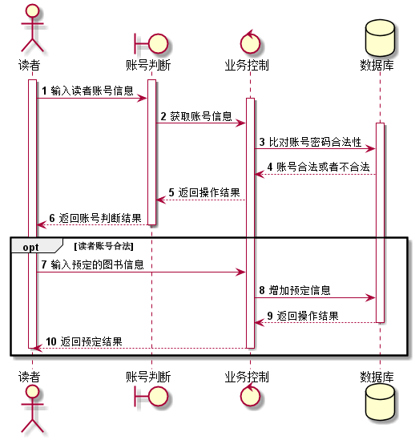
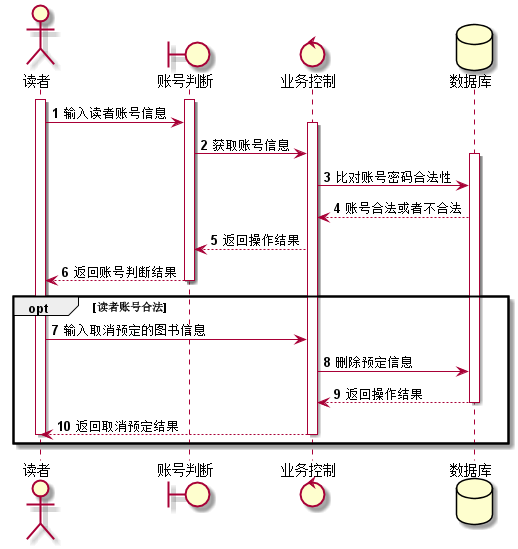

何佳倩的实验报告
============
## 实验四（test4）：图书管理系统的顺序图

|学号|班级|姓名|
|:---------------:|:------------:|:------------:|
|201510414110|软工15-1|何佳倩|

### 1.借书

**1.1借书PlantUML源码如下：**
~~~

@startuml
actor 图书管理员
boundary 账号判断
control 业务控制
database 数据库

autonumber
activate 图书管理员
activate 账号判断
图书管理员 -> 账号判断:输入读者账号信息
activate 业务控制
账号判断 -> 业务控制 : 获取账号信息

activate 数据库
业务控制 -> 数据库 : 比对账号密码合法性
数据库 --> 业务控制 : 账号合法或者不合法
业务控制 --> 账号判断 : 返回操作结果
账号判断 --> 图书管理员 : 返回账号判断结果
deactivate 账号判断
opt 借书账号合法
图书管理员 -> 业务控制 : 输入借出图书信息
业务控制 -> 数据库 : 增加借阅信息
业务控制 -> 数据库 : 修改图书库存
数据库 --> 业务控制 : 返回操作结果
deactivate 数据库

业务控制 --> 图书管理员 : 返回借出结果
deactivate 业务控制
deactivate 图书管理员
end
@enduml
~~~

**1.2借书用例顺序图如下：**

**1.3借书用例顺序图说明：**
~~~
1.参与者：图书管理员(actor)、账号判断(boundary)、业务控制(control)、数据库(database)。 
2.读者账号不合法则不再进行借书的操作
3.借出图书：输入借出图书信息->增加借阅信息->修改图书库存->返回借出结果
~~~
### 2.还书用例

**2.1还书用例PlantUml源码如下：**

~~~

@startuml
actor 图书管理员
boundary 账号判断
control 业务控制
database 数据库

autonumber
activate 图书管理员
activate 账号判断
图书管理员 -> 账号判断:输入读者账号信息
activate 业务控制
账号判断 -> 业务控制 : 获取账号信息

activate 数据库
业务控制 -> 数据库 : 比对账号密码合法性
数据库 --> 业务控制 : 账号合法或者不合法
业务控制 --> 账号判断 : 返回操作结果
账号判断 --> 图书管理员 : 返回账号判断结果
deactivate 账号判断
opt 借书账号合法
图书管理员 -> 业务控制 : 输入归还图书信息
业务控制 -> 数据库 : 删除借阅信息
业务控制 -> 数据库 : 修改图书库存
业务控制 -> 数据库 : 查询借阅是否超时
数据库 --> 业务控制 : 返回操作结果
deactivate 数据库

业务控制 --> 图书管理员 : 返回归还结果
deactivate 业务控制
deactivate 图书管理员
end
@enduml
~~~

**2.2还书用例图的顺序如下：**

**2.3还书用例顺序图说明：**
~~~
1.参与者：图书管理员(actor)、账号判断(boundary)、业务控制(control)、数据库(database)。 
2.读者账号不合法则不再进行还书的操作，判断后决定是否进行还书操作
3.归还图书：输入归还图书信息->删除借阅信息->修改图书库存->返回操作结果->返回归还结果
~~~

### 3.维护图书信息

**3.1维护图书信息用例的PlantUml源码**
~~~

@startuml
actor 图书管理员
boundary 图书合法性判断
control 业务控制
database 数据库

autonumber
activate 图书管理员
activate 图书合法性判断
图书管理员 -> 图书合法性判断:输入图书信息
activate 业务控制
图书合法性判断 -> 业务控制 : 获取图书信息

activate 数据库
业务控制 -> 数据库 : 图书是否存在
数据库 --> 业务控制: 图书存在或者不存在
业务控制 --> 图书合法性判断: 返回操作结果
图书合法性判断 --> 图书管理员 : 返回判断结果
deactivate 图书合法性判断
opt 图书存在
图书管理员 -> 业务控制 : 输入图书信息
业务控制 -> 数据库 : 修改图书信息
数据库 --> 业务控制 : 返回操作结果
deactivate 数据库

业务控制 --> 图书管理员 : 返回维护图书结果
deactivate 业务控制
deactivate 图书管理员
end
@enduml
~~~

**3.2维护图书用例顺序图如下：**

**3.3维护图书用例顺序图说明：**
~~~
1.参与者：图书管理员(actor)、图书合法性判断(boundary)、业务控制(control)、数据库(database)。 
2.图书不存在则不再进行维护图书信息的操作，判断后决定是否进行还书操作
3.维护图书：输入图书新信息->修改图书信息->返回操作结果->返回维护图书结果
~~~

### 4.维护读者信息
**4.1维护读者信息用例的PlantUml源码如下：**
~~~

@startuml
actor 图书管理员
boundary 图书合法性判断
control 业务控制
database 数据库

autonumber
activate 图书管理员
activate 图书合法性判断
图书管理员 -> 图书合法性判断:输入图书信息
activate 业务控制
图书合法性判断 -> 业务控制 : 获取图书信息

activate 数据库
业务控制 -> 数据库 : 图书是否存在
数据库 --> 业务控制: 图书存在或者不存在
业务控制 --> 图书合法性判断: 返回操作结果
图书合法性判断 --> 图书管理员 : 返回判断结果
deactivate 图书合法性判断
opt 图书存在
图书管理员 -> 业务控制 : 输入图书信息
业务控制 -> 数据库 : 修改图书信息
数据库 --> 业务控制 : 返回操作结果
deactivate 数据库

业务控制 --> 图书管理员 : 返回维护图书结果
deactivate 业务控制
deactivate 图书管理员
end
@enduml
~~~

**4.2维护读者信息用例顺序图如下：**

**4.3维护读者信息用例顺序图说明：**
~~~
1.参与者：图书管理员(actor)、账号判断(boundary)、业务控制(control)、数据库(database)。 
2.账号不合法则不再进行维护读者信息的操作，判断后决定是否进行维护读者信息的操作
3.维护读者信息：输入读者新信息->修改读者信息->返回操作结果->返回维护读者信息结果
~~~
### 5.查询图书信息
**5.1查询图书信息用例的PlantUml源码如下：**
 ~~~ 
@startuml
actor 游客
control 业务控制
database 数据库
entity 图书信息

autonumber

activate 业务控制
游客 -> 业务控制 :  输入图书信息
activate 数据库
业务控制 -> 数据库 : 根据图书信息查询对应图书
数据库 --> 业务控制 : 返回查询结果
deactivate 数据库
activate 图书信息
业务控制 -> 图书信息 : 生成图书信息列表
deactivate 业务控制
图书信息 --> 游客	: 返回图书信息
deactivate 图书信息

@enduml
 ~~~
 
**5.2查询图书信息用例顺序图如下：**
 
 
 
 
**5.3查询图书信息用例顺序图说明：**
 ~~~
 1.参与者：游客(actor)、业务控制(control)、数据库(database)、图书信息(entity)。
 2.查询图书：输入图书信息->根据图书信息查询对应图书->返回查询结果->生成图书信息列表->返回图书信息
 ~~~  
 ### 6.查询借阅信息
**6.1查询借阅信息用例的PlantUml源码如下：**
  ~~~ 
@startuml
actor 读者 
boundary 权限判断
control 业务控制
database 数据库
entity 借书记录

autonumber

activate 权限判断
读者 -> 权限判断 :  输入账号信息
activate 业务控制
权限判断 -> 业务控制 : 获取账号信息
deactivate 权限判断
activate 数据库
业务控制 -> 数据库 : 比对账号密码合法性
数据库 --> 业务控制 : 账号合法
opt 读者账号合法
读者 -> 业务控制 :  查询借阅信息
业务控制 -> 数据库 : 查询借阅表
数据库 --> 业务控制 : 返回查询结果
deactivate 数据库
activate 借书记录
业务控制 -> 借书记录 : 生成借书记录列表
deactivate 业务控制
借书记录 -> 读者 : 返回查询结果
deactivate 借书记录
end

@enduml
 ~~~
  
**6.2查询借阅用例顺序图如下：**
  
 
  
  
**6.3查询借阅信息用例顺序图说明：**
~~~
1.参与者：读者(actor)、权限判断(boundary)、业务控制(control)、数据库(database)、借书记录(entity)。 
2.判断读者账号是否合法，不合法不能进行查询借阅信息操作
3.查询借阅信息：查询借阅信息->查询借阅表->返回查询结果->生成借书记录列表->返回查询结果 
~~~ 

  
### 7.预定图书
  
**7.1预定图书用例的PlantUml源码如下：**
~~~

@startuml
actor 读者
boundary 账号判断
control 业务控制
database 数据库

autonumber
activate 读者
activate 账号判断
读者 -> 账号判断:输入读者账号信息
activate 业务控制
账号判断 -> 业务控制 : 获取账号信息

activate 数据库
业务控制 -> 数据库 : 比对账号密码合法性
数据库 --> 业务控制 : 账号合法或者不合法
业务控制 --> 账号判断 : 返回操作结果
账号判断 --> 读者 : 返回账号判断结果
deactivate 账号判断
opt 读者账号合法
读者 -> 业务控制 : 输入预定的图书信息
业务控制 -> 数据库 : 增加预定信息
数据库 --> 业务控制 : 返回操作结果
deactivate 数据库

业务控制 --> 读者 : 返回预定结果
deactivate 业务控制
deactivate 读者
end
@enduml
 ~~~
   
**7.2预定图书用例顺序图如下：**
   

   
   
**7.3预定图书用例顺序图说明：**
 ~~~
1.参与者：读者(actor)、权限判断(boundary)、业务控制(control)、数据库(database)、借书记录(entity)。 
2.判断读者账号是否合法，不合法不能进行预定图书操作
3.预定图书：输入预定图书信息->增加预定信息->返回操作结果->返回预定结果
 ~~~
### 8.取消预定
   
**8.1取消预定用例的PlantUml源码如下：**
~~~

@startuml
actor 读者
boundary 账号判断
control 业务控制
database 数据库

autonumber
activate 读者
activate 账号判断
读者 -> 账号判断:输入读者账号信息
activate 业务控制
账号判断 -> 业务控制 : 获取账号信息

activate 数据库
业务控制 -> 数据库 : 比对账号密码合法性
数据库 --> 业务控制 : 账号合法或者不合法
业务控制 --> 账号判断 : 返回操作结果
账号判断 --> 读者 : 返回账号判断结果
deactivate 账号判断
opt 读者账号合法
读者 -> 业务控制 : 输入取消预定的图书信息
业务控制 -> 数据库 : 删除预定信息
数据库 --> 业务控制 : 返回操作结果
deactivate 数据库

业务控制 --> 读者 : 返回取消预定结果
deactivate 业务控制
deactivate 读者
end
@enduml
 ~~~
    
**8.2取消预定用例顺序图如下：**
    

    
    
**8.3取消预定用例顺序图说明：**
  ~~~
 1.参与者：读者(actor)、权限判断(boundary)、业务控制(control)、数据库(database)、借书记录(entity)。 
 2.判断读者账号是否合法，不合法不能进行预定图书操作
 3.取消预定：输入取消预定图书信息->删除预定信息->返回操作结果->返回查询结果
  ~~~ 