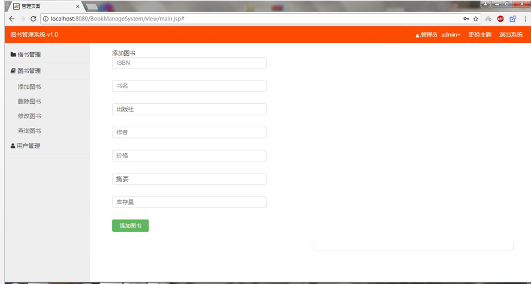

何佳倩的实验报告
============
## 实验五（test5）：图书管理系统数据库设计和界面设计

|学号|班级|姓名|
|:---------------:|:------------:|:------------:|
|201510414110|软工15-1|何佳倩|

### 1.数据库表设计

**1.1 图书表**

|字段|类型|主键/外键|可以为空|约束|说明|
|:-------:|:-------------:|:------:|:----:|:---:|:-----|    
|ISBN|varchar(100)|主键|否||ISBN|  
|bookName|varchar(100)| |否||书名|
|author|varchar(100)| |否||作者|  
|publisher|varchar(100)| |否||出版社|
|price|float(100)| |否||价格|  
|stock|int(100)| |否||库存|  
|summary|varchar(100)| |是||摘要|


**1.2 读者表**

|字段|类型|主键/外键|可以为空|约束|说明|
|:-------:|:-------------:|:------:|:----:|:---:|:-----|    
|readerId|varchar(100)|主键|否||读者账号|
|name|varchar(100)| |否|||  
|password|varchar(100)| |否|||


**1.3 图书管理员表**

|字段|类型|主键/外键|可以为空|约束|说明|
|:-------:|:-------------:|:------:|:----:|:---:|:-----|    
|managerId|varchar(100)|主键|否||管理员账号|
|name|varchar(100)| |否|||  
|password|varchar(100)| |否|||
 

**1.4 借书表**

|字段|类型|主键/外键|可以为空|约束|说明|
|:-------:|:-------------:|:------:|:----:|:---:|:-----|    
|id|int(100)|主键|否|||
|readerId|varchar(100)|外键|否|||  
|ISBN|varchar(100)|外键|否|||
|statu|bit||否||该次借书记录是否为预定|
|rent_time|date||否||借书时间| 
|return_time|date||是||还书时间时间|

## 2. 界面设计
**2.1 图书管理界面设计**

- 用例图参见：维护图书用例
- 类图参见：图书类
- 顺序图参见：维护图书顺序图
- API接口如下：

1. 添加图书

- 功能：用于添加新图书
- 请求地址： http://localhost:8080/BookManageSystem/book/insert
- 请求方法：POST
- 请求参数：Book(JavaBean)

|参数名称|必填|说明|
|:-------:|:-------------: | :----------:|
|Book|是|图书类对象 |
|method|是|固定为 “POST”。|

- 返回实例：
```
{
    "code": 200,
    "data": {
            "ISBN": "9787302329824",
            "name": "信息系统分析与设计",
            "publisher": "清华大学出版社",
            "price": "45.00",
            "stock": 25,
            "summary": "该书可用作信息管理与信息系统、计算机应用、软件工程等专业的教材"
            "flag":true,
     },
    "msg": "响应成功"
}
```
- 返回参数说明：
    
|参数名称|说明|
|:-------:|:-------------: |
|msg|请求响应结果|
|data|返回的主体信息|
|code|返回码|
|flag|图书是否添加成功|

2. 图书删除

- 功能：用于删除指定图书
- 请求地址： http://localhost:8080/BookManageSystem/book/delete
- 请求方法：GET
- 请求参数：ISBN(String)

|参数名称|必填|说明|
|:-------:|:-------------: | :----------:|
|ISBN|是|用于指定删除的图书 |
|method|是|固定为 “POST”。|

- 返回实例：
```
{
    "code": 200,
    "data": {
            "flag":true,
     },
    "msg": "响应成功"
}
```
- 返回参数说明：
    
|参数名称|说明|
|:-------:|:-------------: |
|msg|请求响应结果|
|data|返回的主体信息|
|code|返回码|
|flag|图书是否删除成功|

3. 修改图书

- 功能：用于修改指定图书
- 请求地址： http://localhost:8080/BookManageSystem/book/modify
- 请求方法：POST
- 请求参数：Book(JavaBean)

|参数名称|必填|说明|
|:-------:|:-------------: | :----------:|
|Book|是|图书类对象 |
|method|是|固定为 “POST”。|

- 返回实例：
```
{
    "code": 200,
    "data": {
            "ISBN": "9787302329824",
            "name": "信息系统分析与设计",
            "publisher": "清华大学出版社",
            "price": "45.00",
            "stock": 25,
            "summary": "该书可用作信息管理与信息系统、计算机应用、软件工程等专业的教材"
            "flag":true,
     },
    "msg": "响应成功"
}
```
- 返回参数说明：
    
|参数名称|说明|
|:-------:|:-------------: |
|msg|请求响应结果|
|data|返回的主体信息|
|code|返回码|
|flag|图书是否修改成功|

4. 图书查询

- 功能：用于获取指定图书
- 请求地址： http://localhost:8080/BookManageSystem/book/select
- 请求方法：GET
- 请求参数：ISBN(String)

|参数名称|必填|说明|
|:-------:|:-------------: | :----------:|
|ISBN|是|用于指定查询的图书 |
|method|是|固定为 “POST”。|

- 返回实例：
```
{
    "code": 200,
    "data": {
            "ISBN": "9787302329824",
            "name": "信息系统分析与设计",
            "publisher": "清华大学出版社",
            "price": "45.00",
            "stock": 25,
            "summary": "该书可用作信息管理与信息系统、计算机应用、软件工程等专业的教材"
     },
    "msg": "响应成功"
}
```
- 返回参数说明：
    
|参数名称|说明|
|:-------:|:-------------: |
|msg|请求响应结果|
|data|图书的信息|
|code|返回码|


