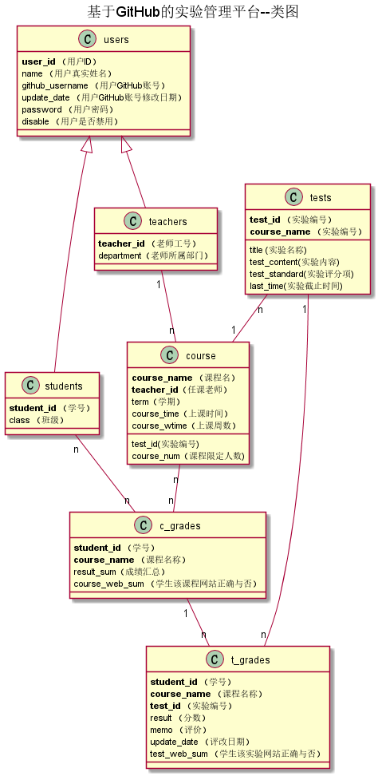

<!-- markdownlint-disable MD033-->
<!-- 禁止MD033类型的警告 https://www.npmjs.com/package/markdownlint -->

# 基于GitHub的实验管理平台的分析与设计

### 成都大学信息科学与工程学院

|学号|班级|姓名|
|:-------:|:-------------: | :----------:|
|201510414110|软件(本)15-1|何佳倩|

## 1. 概述
- 基于GitHub的实验管理平台的作用是在线管理实验成绩的Web应用系统，支持多学期，多课程，多实验评分项，老师管理实验。学生和老师的实验内容均存放在GitHUB
页面上。
- 学生的功能主要有：1.设置自己的GitHub用户名，2.选课，3.是查询自己的实验成绩。。
- 老师的功能主要有：1.选课，2.批改每个学生成绩，3.查看每个学生的成绩。
- 选课时，老师先选，老师选择后学生再选，一门课只能被一个老师选择，每门课有限制人数，人数选满后，学生将不能选择该门课。
- 学生选课成功后，将在该课程成绩中增加一条记录。
- 老师和学生都能通过本系统的链接方便地跳转到学生的每门课程每个GitHUB实验目录，以便批改实验或者查看实验情况。
- 实验成绩按数字分数计算，每项实验自定义评分项，每个实验的详细信息页由老师发布
- 系统自动计算每个学生的所有实验的平均分。
    
## 2. 系统总体结构

界面设计参见：https://nangezi.github.io/is_analysis/test6/ui/菜单.html
    
## 3. 用例图设计 [源码](src/usecase.puml)

## 4. 类图设计 [源码](src/class.puml)

## 5. 数据库设计
- ### [参见数据库设计](./数据库设计.md)

## 6. 用例及界面详细设计
- ### [“学生列表”用例](./用例/学生列表.md),[界面](https://nangezi.github.io/is_analysis/test6/ui/学生列表.html)
- ### [“评定成绩”用例](./用例/评定成绩.md),[界面](https://nangezi.github.io/is_analysis/test6/ui/评定成绩.html)
- ### [“学生查看成绩”用例](./用例/学生查看成绩.md),[界面](https://nangezi.github.io/is_analysis/test6/ui/学生查看成绩.html)
- ### [“老师查看成绩”用例](./用例/老师查看成绩.md),[界面](https://nangezi.github.io/is_analysis/test6/ui/学生列表.html)
- ### [“学生选课”用例](./用例/学生选课.md),[界面](https://nangezi.github.io/is_analysis/test6/ui/学生选课.html)
- ### [“老师选课”用例](./用例/老师选课.md),[界面](https://nangezi.github.io/is_analysis/test6/ui/老师选课.html)
- ### [“查看实验”用例](./用例/查看实验.md),[界面](https://nangezi.github.io/is_analysis/test6/ui/查看实验信息.html)
- ### [“修改实验”用例](./用例/修改实验.md),[界面](https://nangezi.github.io/is_analysis/test6/ui/修改实验信息.html)
- ### [“删除实验”用例](./用例/删除实验.md),[界面](https://nangezi.github.io/is_analysis/test6/ui/修改实验信息.html)
- ### [“增加实验”用例](./用例/增加实验.md),[界面](https://nangezi.github.io/is_analysis/test6/ui/增加实验.html)
- ### [“修改密码”用例](./用例/修改密码.md),[界面](https://nangezi.github.io/is_analysis/test6/ui/修改密码.html)
- ### [“修改用户信息”用例](./用例/修改用户信息.md),[界面](https://nangezi.github.io/is_analysis/test6/ui/修改信息.html)
- ### [“查看用户信息”用例](./用例/查看用户信息.md),[界面](https://nangezi.github.io/is_analysis/test6/ui/查看信息.html)
- ### [“登出”用例](./用例/登出.md),[界面](https://nangezi.github.io/is_analysis/test6/ui/登出.html)
- ### [“登录”用例](./用例/登录.md),[界面](https://nangezi.github.io/is_analysis/test6/ui/登录.html)

    