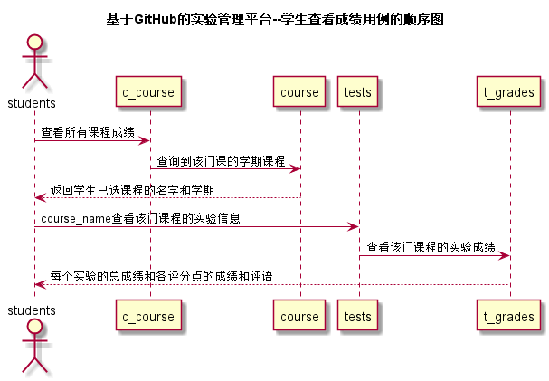
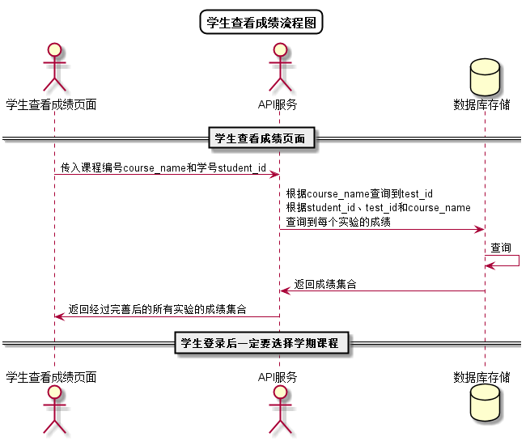

<!-- markdownlint-disable MD033-->
<!-- 禁止MD033类型的警告 https://www.npmjs.com/package/markdownlint -->

# “学生查看成绩”用例 [返回](../README.md)
## 1. 用例规约

|用例名称|学生查看成绩|
|-------|:-------------|
|功能|学生查看自己的每个实验的实验成绩及实验评价|
|参与者|学生|
|前置条件|学生需要先登录，选择学期课程后才能查看|
|后置条件| |
|主事件流|学生点击平均分超链接跳转至 |
|备选事件流| |

## 2. 业务流程（顺序图） [源码](../src/学生查看成绩顺序图.puml)
 

## 3. 界面设计
- 界面参照: https://nangezi.github.io/is_analysis/test6/ui/学生查看成绩.html
- API接口调用
    - 接口1：[getOneStudentsResults](../接口/getOneStudentsResults.md) 

## 4. 算法描述[源码](../src/学生查看成绩流程图.puml)

    
- RESULT解析为列表
    - RESULT是接口getOneStudentResults的返回值中的一部分，形如："RESULT": "91$$60$$15$$10$$6"。需要在前端进行解析。
    - 成绩汇总（来自T_GRADES表），以$$分开，第一个成绩是该次实验的总成绩,后面是每个评分点的成绩    
    - 比如：“91$$60$$15$$10$$6”表示一共有4个评分点，4个评分项的成绩分别是60,15,10,6，总成绩是91
    - 算法是使用使用字符串分离方法将其分开。
    
## 5. 参照表
- [STUDENTS](../数据库设计.md/#STUDENTS)
- [T_GRADES](../数据库设计.md/#T_GRADES)
- [C_GRADES](../数据库设计.md/#C_GRADES)
- [TESTS](../数据库设计.md/#TESTS)
