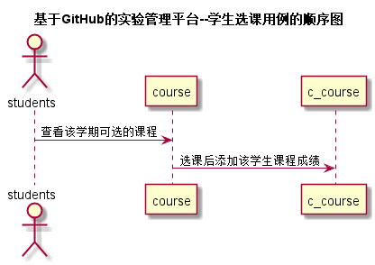
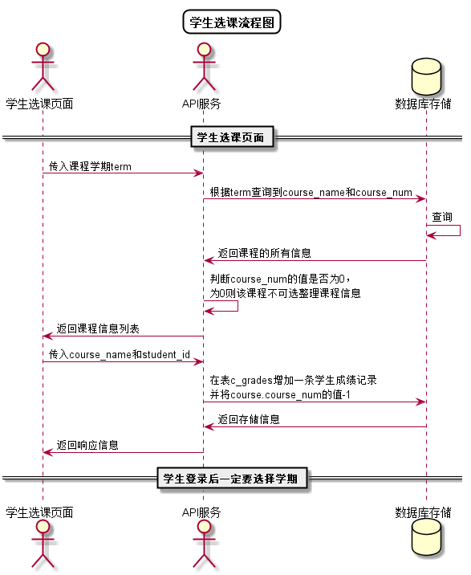

# “学生选课”用例 [返回](../README.md)

## 1. 用例规约

|用例名称|学生选课|
|-------|:-------------|
|功能|学生选择所修课程|
|参与者|学生|
|前置条件| 以学生的身份登录成功|
|后置条件||
|主事件流| 1.学生点击学期下拉菜单进行选择 2.系统显示该学期的课程列表 3.学生选择未满课程|
|备选事件流|1a. 学生无学期选择  &nbsp;&nbsp; 1.下拉菜单无选项   &nbsp;&nbsp; 2a. 无课程列表  &nbsp;&nbsp; 1.数据库查询出错   &nbsp;&nbsp; 2.所有课程均已选满 |

## 2. 业务流程[源码](../src/学生选课顺序图.puml)

## 3. 界面设计
- 界面参照: https://nangezi.github.io/is_analysis/test6/src/ui/学生选课.html
- API接口调用
    - 接口1：[getStudentCourse](../接口/getStudentCourse.md)

## 4. 算法描述 [源码](../src/学生选课流程图.puml)

    
## 5. 参照表

- [STUDENTS](../数据库设计.md/#STUDENTS)
- [C_COURSES](../数据库设计.md/#C_COURSES)