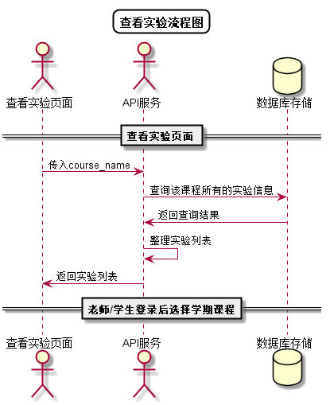

# “查看实验”用例 [返回](../README.md)

## 1. 用例规约

|用例名称|查看实验|
|-------|:-------------|
|功能|查看实验|
|参与者|老师/学生|
|前置条件| 以老师/学生的身份登录进系统选择学期课程|
|后置条件| |
|主事件流| 1. 老师点击查看实验 |
|备选事件流| |

## 2. 业务流程
无 

## 3. 界面设计
- 界面参照: https://nangezi.github.io/is_analysis/test6/src/ui/查看实验.html
- API接口调用
    - 接口1：[getTests](../接口/getTests.md)

## 4. 算法描述 [源码](../src/查看实验流程图.puml)

    
## 5. 参照表

- [TESTS](../数据库设计.md/#TESTS)