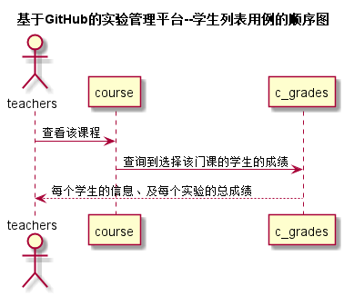
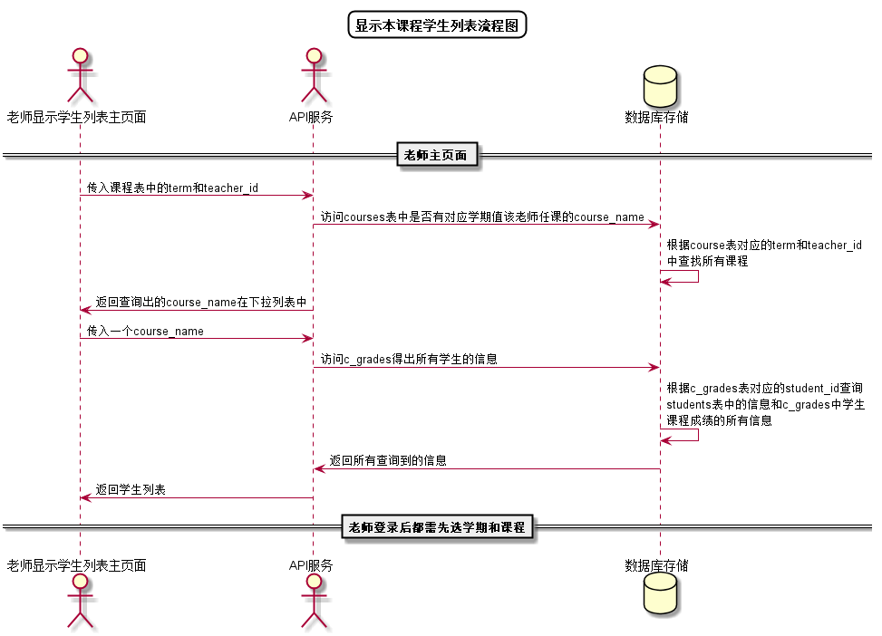

<!-- markdownlint-disable MD033-->
<!-- 禁止MD033类型的警告 https://www.npmjs.com/package/markdownlint -->

# “老师查看成绩”用例 [返回](../README.md)
## 1. 用例规约

|用例名称|老师查看成绩|
|-------|:-------------|
|功能|老师查看学生的成绩|
|参与者|老师|
|前置条件|老师登录后选择课程后才能查看学生成绩|
|后置条件| |
|主事件流| |
|备选事件流| |

## 2. 业务流程（顺序图） [源码](../src/学生列表顺序图.puml)
 

## 3. 界面设计
- 界面参照: https://nangezi.github.io/is_analysis/test6/ui/老师查看成绩.html
- API接口调用
    - 接口1：[getStudents](../接口/getStudents.md) 

## 4. 算法描述[源码](../src/学生列表流程图.puml)

    
- RESULT_SUM解析为列表
    - RESULT_SUM是接口getStudents的返回值中的一部分，形如："RESULT_SUM": "81.25,70,80,85,90,N"。需要在前端进行解析。
    - 成绩汇总（来自C_GRADES表），以逗号分开，第一个成绩是平均成绩,后面是每次实验的成绩，N表示未批改，平均分只计算已批改的。    
    - 比如：“81.25,70,80,85,90,N”表示一共批改了4次，第5次未批改，4次的成绩分别是81.25,70,80,85,90,N，4次的平均分是81.25
    - 算法是使用使用字符串分离方法将其分开。
    
## 5. 参照表
- [STUDENTS](../数据库设计.md/#STUDENTS)
- [T_GRADES](../数据库设计.md/#T_GRADES)
- [C_GRADES](../数据库设计.md/#C_GRADES)
- [TESTS](../数据库设计.md/#TESTS)
