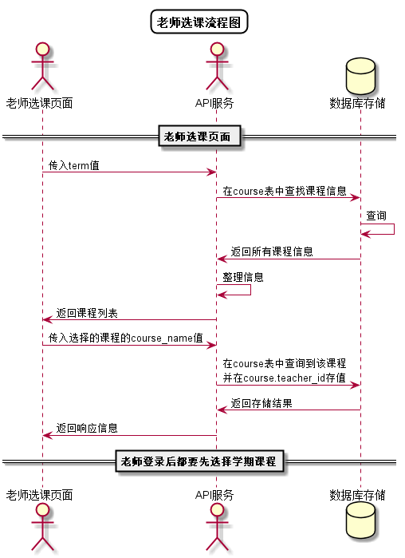

# “老师选课”用例 [返回](../README.md)

## 1. 用例规约

|用例名称|老师选课|
|-------|:-------------|
|功能|老师选择所教授课程|
|参与者|老师|
|前置条件| 以老师的身份登录成功|
|后置条件||
|主事件流| 1.老师点击学期下拉菜单进行选择 2.系统显示该学期的课程列表 3.老师选择任意课程|
|备选事件流|1a. 老师无学期选择  &nbsp;&nbsp; 1.下拉菜单无选项   &nbsp;&nbsp; 2a. 无课程列表  &nbsp;&nbsp; 1.数据库查询出错   &nbsp;&nbsp;|

## 2. 业务流程
无

## 3. 界面设计
- 界面参照: https://nangezi.github.io/is_analysis/test6/src/ui/老师选课.html
- API接口调用
    - 接口1：[getTeacherCourse](../接口/getTeacherCourse.md)

## 4. 算法描述 [源码](../src/老师选课流程图.puml)

    
## 5. 参照表

- [TEACHERS](../数据库设计.md/#TEACHERS)
- [COURSES](../数据库设计.md/#COURSES)