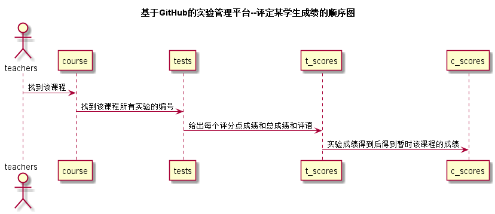
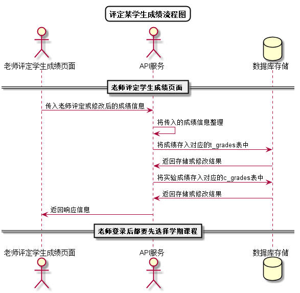

<!-- markdownlint-disable MD033-->
<!-- 禁止MD033类型的警告 https://www.npmjs.com/package/markdownlint -->

# “评定成绩”用例 [返回](../README.md)
## 1. 用例规约

|用例名称|评定成绩|
|-------|:-------------|
|功能|老师评定一个学生的实验成绩|
|参与者|老师|
|前置条件|查看成绩：老师登录之后选择学期和课程后才会显示出有学生成绩的列表|
|后置条件| 评定成绩提交之后，系统自动设置成绩更新日期为评定日期，自动计算平均成绩|
|主事件流| 1. 查看已有的成绩   2. 输入一个或者多个实验的成绩和评语    3. 提交    4. 系统存储实验成绩和评语  5. 系统自动计算平均成绩|
|备选事件流|1a. 学生该实验的github地址不正确  &nbsp;&nbsp; 1.老师无法评定成绩 2a. 老师输入的成绩不合法  &nbsp;&nbsp; 1.总成绩应该在0-100内 &nbsp;&nbsp; 2.每个评分项都已批改|

## 2. 业务流程（顺序图） [源码](../src/评定成绩顺序图.puml)
 

    
## 3. 界面设计
- 界面参照: https://nangezi.github.io/is_analysis/test6/ui/评定成绩.html

- API接口调用

    - 接口1：[getNextPrevStudent](../接口/getNextPrevStudent.md)
        
        用于取得上一个或者下一个学生的学号
        
    - 接口2：[getOneStudentsResults](../接口/getOneStudentsResults.md)
        
        用于显示一个学生的所有实验成绩和评语
         
    - 接口3：[setOneStudentResults](../接口/setOneStudentResults.md)
    
        用于设置一个学生的部分实验成绩和评语
    
## 4. 算法描述[源码](../src/评定成绩流程图.puml)

    
    
## 5. 参照表

- [STUDENTS](../数据库设计.md/#STUDENTS)
- [T_GRADES](../数据库设计.md/#T_GRADES)
- [C_GRADES](../数据库设计.md/#C_GRADES)

